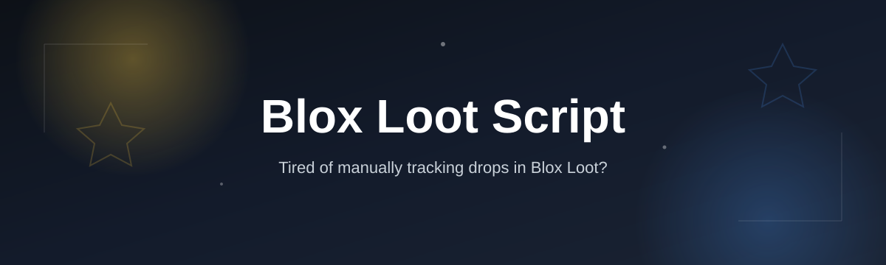
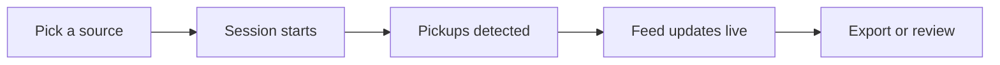

# blox-loot-nova

  

*A lightweight loot tracker built for Roblox-style loot games, made for players who want to know exactly what they picked up and when.*

## What this is

**blox-loot-nova** is a standalone Windows app that watches your active loot session and turns a wall of drops into a readable, timestamped feed. This is the practical shape of a Blox Loot Script for most players: something that sits next to your game, catches item pickups as they happen, and keeps a running log you can actually search later instead of trusting your memory or a pile of screenshots.

It doesn't modify game files or inject anything into a running process — it reads what's already visible (on-screen text, clipboard events, or exported logs, depending on the source you configure) and renders it as a clean overlay or dashboard. That distinction matters for anyone who grinds loot-based Roblox games solo, runs a small trading server, or just wants a second pair of eyes on their session that doesn't lie about drop counts.

  

The button above opens the project's landing page, where the current build of blox-loot-nova is available to download.

## Who it is for

- **Solo grinders** tracking drop rates across multi-hour Roblox loot sessions
- **Trading server admins** who need a shared, agreed-upon loot log for their group
- **Streamers** who want a readable on-screen loot feed for viewers without extra overlay software
- **Event runners** comparing loot value between servers, seeds, or limited-time drops
- **Anyone** who is tired of screenshotting an inventory every ten minutes to prove what dropped

## What you can do

- **Live loot feed** — every pickup appears in a scrolling panel with a timestamp, item name, and source
- **Session export** — dump a full session to CSV or JSON for spreadsheets or Discord posts
- **Custom filters** — hide low-value junk drops or isolate a single item type by name/rarity tag
- **Overlay mode** — a borderless, click-through panel that sits on top of the game window
- **Hotkey controls** — pause, clear, or snapshot the feed without touching your mouse
- **Multi-profile tracking** — keep separate logs for different accounts, servers, or events
- **Drop-rate summary** — a running percentage breakdown by rarity for the current session
- **Session diff** — compare two exported logs to see what changed between runs

## Getting started

1. Open the landing page using the download button above.
2. Download the latest `blox-loot-nova` build for Windows.
3. Extract the folder anywhere you have write access (no install wizard).
4. Run `blox-loot-nova.exe`, then point it at your game window from the source picker.
5. Start your session — the feed panel begins logging as soon as it detects the first pickup.

**Quick reference — default hotkeys and flags**

| Action | Shortcut | Notes |
|---|---|---|
| Pause / resume feed | `Ctrl+Shift+P` | Freezes the panel without closing it |
| Clear current session | `Ctrl+Shift+C` | Session history stays in the export buffer |
| Toggle overlay mode | `Ctrl+Shift+O` | Switches between window and click-through overlay |
| Export session | `Ctrl+Shift+E` | Prompts for CSV or JSON |
| Snapshot feed | `Ctrl+Shift+S` | Saves a PNG of the current panel |
| Launch flag `--minimized` | CLI arg | Starts in the tray instead of a visible window |
| Launch flag `--profile <name>` | CLI arg | Loads a saved profile on startup |

## Requirements

- Windows 10 or Windows 11, 64-bit
- No install, no toolchain, no runtime setup — the app ships as a standalone executable
- Roblox running in windowed or borderless mode (fullscreen exclusive is not supported by the overlay)
- Roughly 60 MB of free disk space for the app plus session exports

## How it works

1. **Pick a source** — choose how blox-loot-nova reads your session (screen region, clipboard, or log file).
2. **Session starts** — a new session ID is created and the feed panel opens.
3. **Pickups detected** — each new item is parsed, timestamped, and matched against known rarity/value data where available.
4. **Feed updates live** — the panel and drop-rate summary refresh without you needing to click anything.
5. **Export or review** — close out the session with a CSV/JSON export or leave it running for the next drop.

## FAQ

**Is blox-loot-nova a Roblox mod or plugin?**
No. It doesn't touch Roblox's client files or memory. It reads visible session data from outside the game and displays it in its own window.